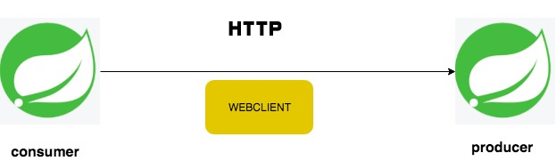

# spring-webflux-rest-client
This project demonstrates usage of spring 5 web flux rest client for communicating between microservices.

## Spring WebFlux - WebClient

Spring WebFlux includes a reactive, non-blocking WebClient for HTTP requests. The client has a functional, fluent API with reactive types for declarative composition, see Reactive Libraries. WebFlux client and server rely on the same non-blocking codecs to encode and decode request and response content.

<table>
 <tr>
    <th style="text-align:left">Name</th>
    <th style="text-align:left">Port</th> 
    <th style="text-align:left">Description</th>
  </tr>
  <tr>
    <td><a href="https://github.com/BarathArivazhagan/spring-webflux-rest-webclient/tree/master/spring-web-flux-consumer"> spring-web-flux-consumer</a></td>
    <td>8087</td>
    <td>spring-web-flux-consumer</td>
  </tr>
  <tr>
    <td><a href="https://github.com/BarathArivazhagan/spring-webflux-rest-webclient/tree/master/spring-web-flux-producer">spring-web-flux-producer</a></td>
    <td>9500</td>
    <td>spring-web-flux-producer</td>
  </tr>
</table>
